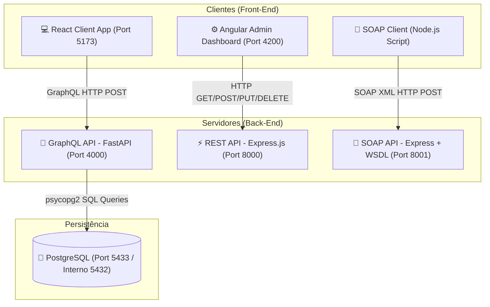

# 🍕 Furreti Cucina - Ecossistema Full-Stack de Pizzaria

Este é um projeto acadêmico completo desenvolvido para a cadeira de **Computação em Nuvem**. O ecossistema simula um fluxo de ponta a ponta (end-to-end) para uma pizzaria moderna, combinando múltiplos padrões arquiteturais de comunicação de dados (**GraphQL, REST e SOAP**) e múltiplos frameworks front-end (**React e Angular**), todos conteinerizados em **Docker**.

---

## 📐 Arquitetura do Sistema

O projeto é estruturado em microsserviços e aplicações independentes que se comunicam através de uma rede bridge virtual do Docker:



---

## 🛠️ Stack Tecnológica & Onde Foi Aplicada

### 1. Front-End
*   **React (Vite)**: Aplicado no desenvolvimento do **E-Commerce do Cliente** (interface pública de pedidos e carrinho), permitindo navegação fluida de compra e integração reativa de estado com Context API.
*   **Angular 19 (Standalone)**: Aplicado no **Painel Administrativo da Pizzaria**, servindo como interface de gestão para CRUD de pizzas de forma separada e modular.
*   **AngularJS (Angular v1.x)**: Aplicado como uma interface administrativa **embutida diretamente no microsserviço da API RESTful** (porta `8000`), demonstrando compatibilidade de tecnologias legadas.
*   **Apollo Client**: Aplicado na comunicação de dados no React para realizar queries e mutations reativas com o servidor GraphQL.
*   **Vanilla CSS**: Aplicado na estilização visual premium de todas as interfaces web (React, Angular e AngularJS) usando variáveis CSS e design responsivo sem bibliotecas externas.

### 2. Back-End
*   **FastAPI & Ariadne (Python)**: Aplicado no **Servidor GraphQL principal** (porta `4000`), responsável pelo gerenciamento de usuários, endereços, cartões de crédito e pedidos transacionais.
*   **Express.js (Node.js)**: Aplicado na construção da **API RESTful de Pizzas** (porta `8000`) e no **Servidor SOAP da Calculadora** (porta `8001`).
*   **soap (Biblioteca npm)**: Aplicada no microsserviço SOAP para expor a calculadora de frete/taxas sob demanda por meio de um contrato WSDL estruturado.
*   **psycopg2-binary**: Aplicado no backend FastAPI para estabelecer queries SQL nativas e de alta performance direto com o banco relacional.

### 3. Banco de Dados & Infraestrutura
*   **PostgreSQL**: Banco de dados relacional que persiste as tabelas de Usuários, Pizzas (cardápio), Pedidos e Itens do Pedido.
*   **Docker & Docker Compose**: Utilizado para containerizar e isolar todos os serviços do back-end (`backend`, `api-restful`, `servico-soap` e `postgres-db`) em uma rede virtual unificada (`pizza_network`), garantindo consistência idêntica entre o desenvolvimento local e a produção.

### 4. Nuvem AWS (Implantação Real) ☁️
Para a cadeira de Computação em Nuvem, realizamos o deploy completo do ecossistema de back-end em produção real na AWS:
*   **AWS EC2 (Elastic Compute Cloud)**: Provisionamento de um servidor virtual rodando a imagem oficial do **Amazon Linux 2023** (instância `t3.micro`), onde os containers Docker do backend foram implantados.
*   **AWS EBS (Elastic Block Store)**: Armazenamento persistente de **20 GiB** associado à instância para suportar o sistema operacional, imagens Docker e os dados persistidos do PostgreSQL.
*   **Security Groups (Firewall da AWS)**: Regras de tráfego de entrada configuradas para expor os serviços à internet nas seguintes portas:
    *   Porta `22` (SSH): Para controle administrativo e implantação via Git.
    *   Porta `4000` (GraphQL API): Exposta para comunicação do E-Commerce local.
    *   Porta `8000` (REST API & Frontend Admin Integrado): Exposta para o painel de gerenciamento.
    *   Porta `8001` (SOAP API): Exposta para o cliente SOAP remoto.
    *   Portas `5173` (React) e `4200` (Angular): Expostas opcionalmente para acesso direto aos servidores de desenvolvimento Web.
*   **User Data Script**: Script Bash de inicialização utilizado na AWS para automatizar a instalação das dependências (Docker, Docker Compose e Git) no primeiro boot da máquina.

---

## 📂 Estrutura de Diretórios

*   [`/backend`](file:///c:/Users/diego/OneDrive/Documentos/Faculdade/Cadeira%20Nuvem/backend): API GraphQL em Python, arquivos de esquema e scripts de semeadura do banco de dados.
*   [`/api-restful`](file:///c:/Users/diego/OneDrive/Documentos/Faculdade/Cadeira%20Nuvem/api-restful): API REST em Express para gerenciamento de pizzas e seu respectivo cliente web embutido.
*   [`/servico-soap`](file:///c:/Users/diego/OneDrive/Documentos/Faculdade/Cadeira%20Nuvem/servico-soap): Serviço SOAP de calculadora e script cliente para chamadas XML.
*   [`/frontend`](file:///c:/Users/diego/OneDrive/Documentos/Faculdade/Cadeira%20Nuvem/frontend): Aplicação React do e-commerce do cliente.
*   [`/frontend-angular`](file:///c:/Users/diego/OneDrive/Documentos/Faculdade/Cadeira%20Nuvem/frontend-angular): Painel do administrador em Angular para CRUD de pizzas.
*   [`/deploy-nuvem`](file:///c:/Users/diego/OneDrive/Documentos/Faculdade/Cadeira%20Nuvem/deploy-nuvem): Instruções passo a passo de deploy e infraestrutura na nuvem AWS.

---

## 🚦 Passo a Passo para Execução do Projeto

### Pré-requisitos
*   [Docker Desktop](https://www.docker.com/products/docker-desktop) instalado e rodando.
*   [Node.js (versão 18+)](https://nodejs.org/) instalado para executar os front-ends localmente.

---

### Passo 1: Subir a Infraestrutura Geral (Back-End + PostgreSQL)
Abra um terminal na raiz do projeto e execute:
```bash
docker-compose up -d
```
*Este comando baixa a imagem do Postgres, compila os Dockerfiles dos servidores Node e Python, e ativa todos os containers na rede bridge interna.*

Para verificar se tudo subiu corretamente:
```bash
docker ps
```
Você verá 4 containers rodando (`pizza_backend`, `pizza_rest_api`, `calculadora_soap_service`, `pizza_postgres`).

---

### Passo 2: Executar o E-Commerce Principal (React)
Abra um novo terminal na pasta `/frontend` e execute:
```bash
cd frontend
npm install
npm run dev
```
O site do cliente estará disponível em: **[http://localhost:5173/](http://localhost:5173/)**

---

### Passo 3: Executar o Painel de Administração (Angular)
Abra um novo terminal na pasta `/frontend-angular` e execute:
```bash
cd frontend-angular
npm install
npm start
```
O painel do administrador estará disponível em: **[http://localhost:4200/](http://localhost:4200/)**

---

### Passo 4: Executar os Testes do Serviço SOAP
O serviço SOAP roda no Docker na porta `8001`. Para realizar chamadas diretas de soma/subtração utilizando o cliente Node.js:
1. Abra um terminal na pasta `/servico-soap`.
2. Instale as dependências locais se necessário e execute:
   ```bash
   node client.js
   ```
O terminal fará a conversão XML SOAP de ida e volta e imprimirá os resultados da calculadora remota.

---

### Passo 5: Executar Teste de Performance e Latência
Existe um testador de estresse e latência na raiz do projeto. Ele dispara 50 requisições simultâneas para as APIs para comparar o tempo de resposta:
```bash
node performance_test.js
```
O resultado será exibido em uma tabela comparativa organizada no console.

---

## 🛡️ Decisões Arquiteturais & Segurança
*   **Interoperabilidade de Tecnologias**: O uso de GraphQL em Python no app principal e REST/SOAP em Node.js nos demais simula o ambiente real de grandes corporações que herdaram ou integram microsserviços legados.
*   **Segurança de Borda na API REST**:
    *   **Helmet**: Adiciona cabeçalhos contra ataques XSS e Clickjacking.
    *   **Rate Limiter**: Limita acessos repetidos por IP (máximo de 100 requisições/15min) prevenindo sobrecarga e força bruta.
    *   **Sanitização de Payload**: Tratamento rigoroso de caracteres HTML para impedir injeção persistente de scripts maliciosos (Stored XSS).
